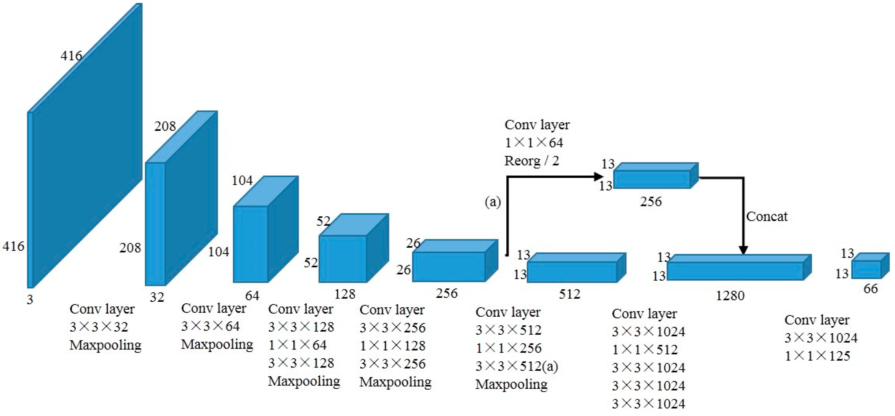

# CSCI596FinalProject
USC CSCI596 Scientific Computing and Visualization Final Project  

Parallel Computing based on the CUDA and OPEMMP to implement YOLO V2 without any framework 
--- 

you can find the detail about YOLO V2 [here](https://arxiv.org/abs/1612.08242)  

The architecture of YOLOV2 like that  
  
this project will be based on Tiny-YoloV2, only focused on **reference** not training 

implement convolutional layer and maxpool layer with CUDA and postprocessing like region with OPENMP

## How to use
>TBD

## Result
image detection  

