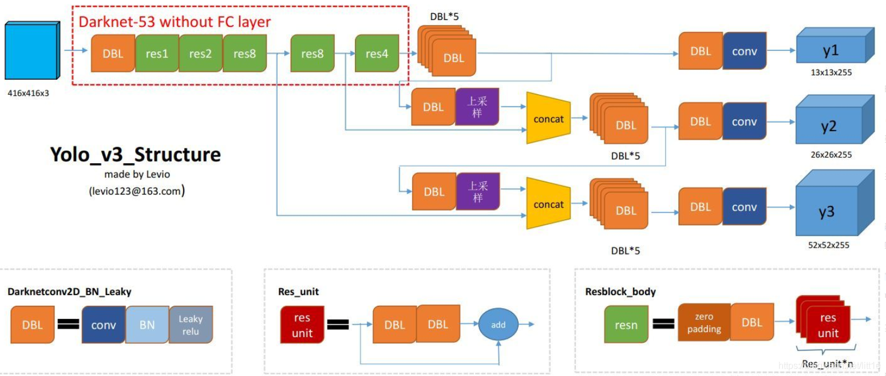

# CSCI596FinalProject
USC CSCI596 Scientific Computing and Visualization Final Project  

Parallel Computing based on pytroch and CUDA to implement YOLO V3
--- 

you can find the detail about YOLO V3 [here](https://pjreddie.com/media/files/papers/YOLOv3.pdf)  

The architecture of YOLOV3 like that  
  
this project will only focuse on **reference** not training, this program will work on GPU if you have installed pytorch with cuda


## How to use

### Requirements
- Python >= 3.5  
- OpenCV  
- PyTorch >= 0.4  

the weights of the yolov3 is large, so you can download [here](https://pjreddie.com/media/files/yolov3.weights), then put it in root  

you can store the images you want to be dectected in imgs file.  
run the command 
```python
python detect.py --images imgs --det det 
```
you will get the result in detect file

## Result
image detection, you can find the raw image in imgs file


